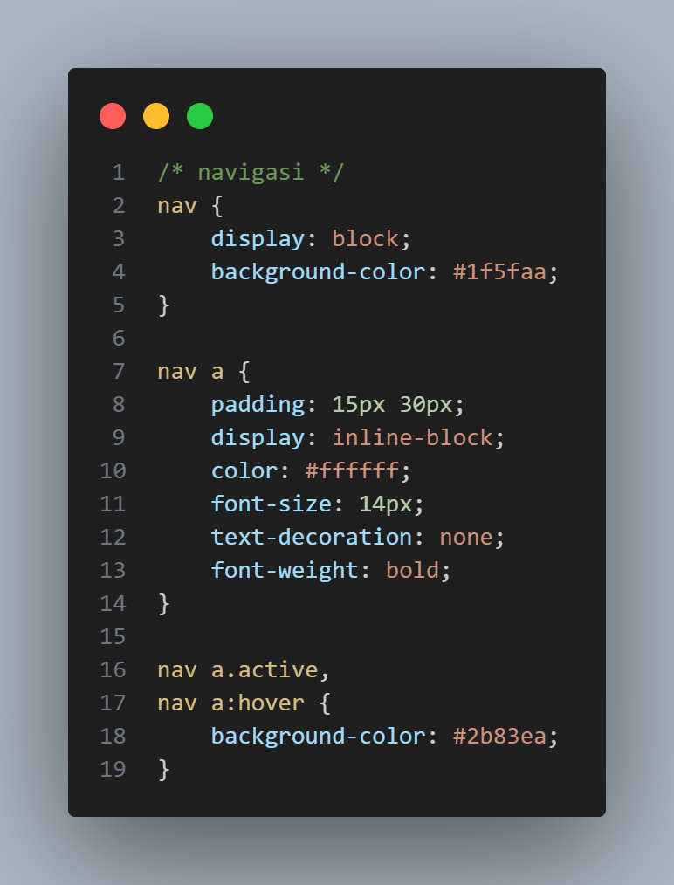

# LAPORAN PRAKTIKUM 4
DAFTAR ISI
==========
- [LAPORAN PRAKTIKUM 4](#laporan-praktikum-4) 
    - [TUJUAN PRAKTIKUM](#tujuan-praktikum)
    - [LANGKAH - LANGKAH MEMBUAT CSS LAYOUT](#langkah-langkah-membuat-css-layout)
    - [KESIMPULAN](#kesimpulan)

## TUJUAN PRAKTIKUM
Tujuan dari kegiatan ini adalah agar mahasiswa mampu memahami struktur dasar dalam pembuatan layout web, menguasai konsep box element, serta memahami penggunaan CSS floating untuk mengatur tata letak elemen pada halaman. Selain itu, mahasiswa juga diharapkan dapat mengenal dan menerapkan elemen semantik HTML5 dengan baik sehingga struktur halaman menjadi lebih terorganisir dan bermakna. Pada akhirnya, melalui pemahaman dan penerapan konsep-konsep tersebut, mahasiswa mampu membuat sebuah layout web sederhana yang fungsional dan menarik secara visual.

## LANGKAH-LANGKAH MEMBUAT CSS LAYOUT

### Step 1 Membuat dokumen HTML
Persiapan membuat dokumen HTML dengan nama file lab4_box.html seperti berikut.

### Step 2 Membuat Box Element
Kemudian tambahkan kode untuk membuat box element dengan tag div seperti berikut.

### Step 3 CSS Float Property
Selanjutnya tambahkan deklarasi CSS pada head untuk membuat float element, seperti berikut.

Kemudian buka browser untuk melihat hasilnya.

### Hasil Tampilan: 

### Step 4 Mengatur Clearfix Element
Clearfix digunakan untuk mengatur element setelah float element. Property clear digunakan untuk
mengaturnya. Tambahkan element div lainnya seteleah div3 seperti berikut.

Kemudian atur property clear pada CSS, seperti berikut.

Selanjutnya buka browser dan refresh kembali.

### Hasil Tampilan:

### Step 5 Membuat Layout Sederhana
Setelah itu tambahkan folder baru dengan nama lab4_layout, kemudian buatlah file baru didalamnya dengan nama home.html, dan file css dengan nama style.css.

Kemudian buatkan kerangka code layout dengan semantics element seperti ini

Kemudian buka browser dan lihat hasilnya.

### Hasil Tampilan:

Kemudian tambahkan kode CSS untuk membuat layoutnya.

Kemudian lihat hasilnya pada browser.

### Hasil Tampilan:

### Step 6 Membuat Navigasi
Kemudian selanjutnya mengatur navigasi.

Kemudian lihat hasilnya.

### Hasil Tampilan:

### Step 7 Membuat Hero Panel.
Selanjutnya membuat hero panel. Tambahkan kode HTML dan CSS seperti berikut.

### Untuk HTML

### Untuk CSS

Kemudian lihat hasilnya kembali.

### Hasil Tampilan:

### Step 8 Mengatur Layout Main dan Sidebar
Selanjutnya mengatur main content dan sidebar, tambahkan CSS float.

### Step 9 Membuat Sidebar Widget
Kemudian selanjutnya menambahkan element lain dalam sidebar.

Kemudian tambahkan CSS.

### Hasil Tampilan:

### Step 10 Mengatur Footer
Selanjutnya mengatur tampilan footer. Tambahkan CSS untuk footer.

### Hasil Tampilan:

### Step 11 Menambahkan Elemen lainnya pada Main Content

Kemudian tambahkan CSS.

### Hasil Tampilan:

### Step 12 Menambahkan Content Artikel
Selanjutnya membuat content artikel. Tambahkan HTML berikut pada main content.

Kemudian tambahkan CSS.

### Hasil Tampilan:

### Step 13 Menambahkan Layout untuk menu About dan menu Contact

### Untuk CSS

### Untuk HTML

Kemudian lihat hasilnya kembali.

## KESIMPULAN
Dari praktikum ini dapat disimpulkan bahwa pembuatan layout web memerlukan pemahaman terhadap struktur dasar HTML, penerapan CSS untuk mengatur tampilan, serta penggunaan elemen-elemen semantik agar halaman lebih terstruktur dan mudah dipahami. Melalui praktikum ini, mahasiswa dapat memahami bagaimana setiap elemen seperti box, floating, dan container bekerja sama dalam membentuk tata letak yang rapi dan responsif. Dengan demikian, mahasiswa mampu merancang dan membangun layout web sederhana yang tidak hanya fungsional tetapi juga estetis sesuai prinsip desain web modern.

